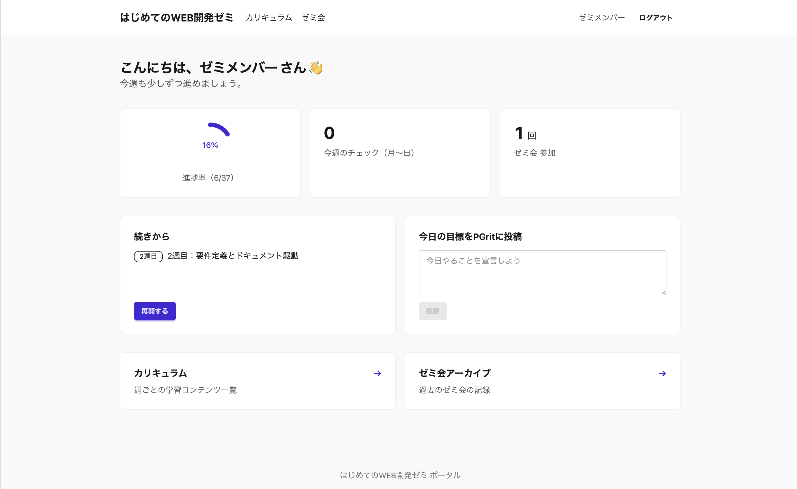
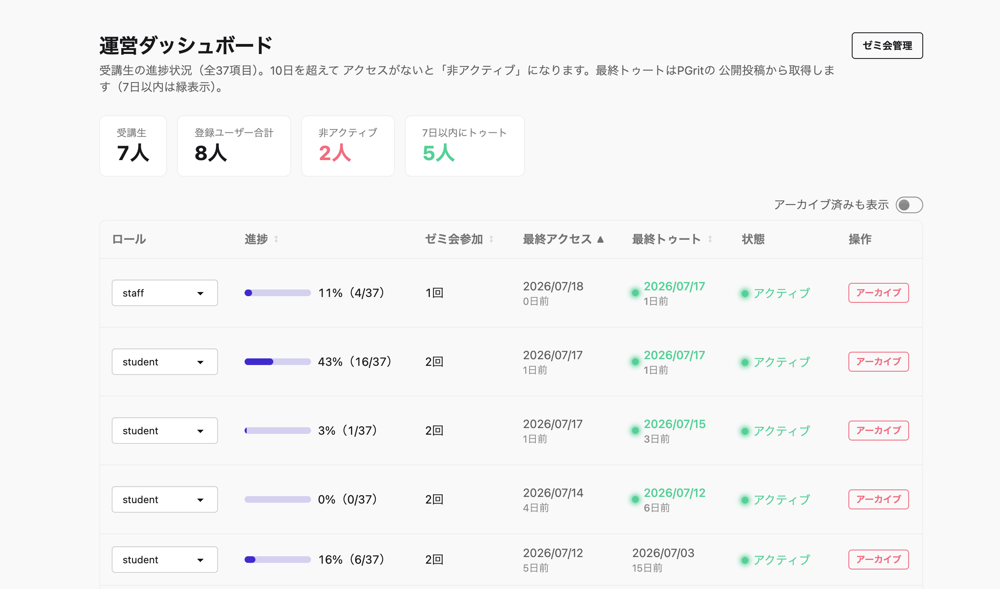
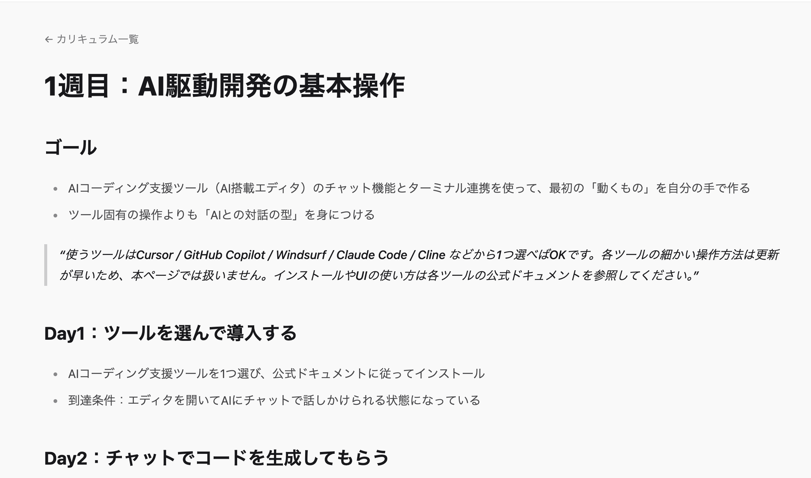
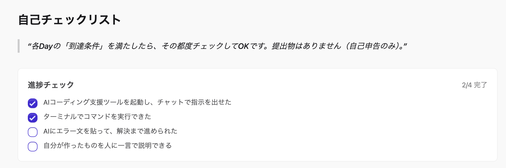
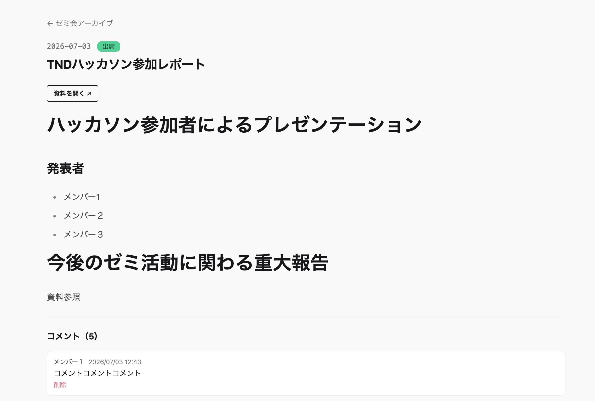
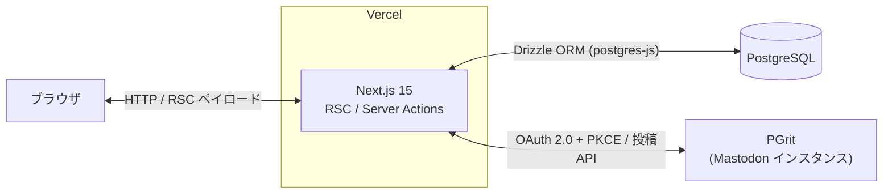
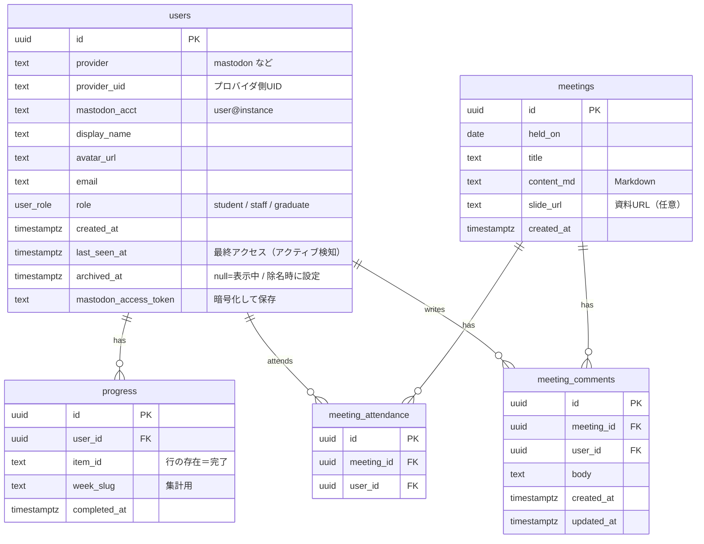
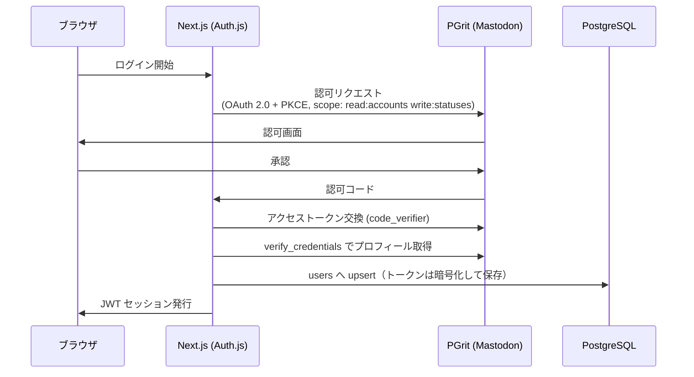

# web-dev-zemi

PlayGround「はじめてのWEB開発ゼミ」の学習ポータル。カリキュラム閲覧・進捗管理・ゼミ会アーカイブ・運営ダッシュボードを備えた Next.js アプリケーションです。

[](https://web-dev-zemi.tech)
[](https://nextjs.org/)
[](https://www.typescriptlang.org/)

> [!NOTE]
> ログインはコミュニティの Mastodon インスタンス「PGrit」アカウント保有者に限定しています。オープンサインアップは意図的に非対応です。

## スクリーンショット

| ホームダッシュボード | 運営ダッシュボード（staff 専用） |
| --- | --- |
|  |  |

| カリキュラムビューア | 進捗チェックリスト |
| --- | --- |
|  |  |



## 主な機能

1. **ホームダッシュボード** — 進捗率・今週のチェック数・ゼミ会参加回数を集計表示。「続きから」で直前の学習箇所へ復帰でき、今日の目標を PGrit へ本人名義でトゥート投稿できます。
2. **カリキュラムビューア** — リポジトリ内の Markdown を `react-markdown` で表示。GFM のタスクリストを進捗チェックリスト化し、項目単位で完了状態を DB に保存します。
3. **ゼミ会アーカイブ** — 開催記録（Markdown）に資料リンク・出席表示・コメントを付与。コメントは PGrit への同時トゥートにも対応します。
4. **運営ダッシュボード（staff 専用）** — 全メンバーの進捗・出席・最終アクセス・最終トゥートを一覧化。10日間の非アクティブ検知、ロール変更、アーカイブ（除名）操作を行えます。
5. **ゼミ会管理（staff 専用）** — 開催記録の作成・編集・削除（CRUD）と出席管理。

## 技術スタック

| 領域 | 採用技術 |
| --- | --- |
| フレームワーク | Next.js 15（App Router / Server Actions 中心。API ルートは Auth.js ハンドラのみ） |
| 言語 | TypeScript |
| スタイリング | Tailwind CSS 4 + daisyUI 5 |
| 認証 | Auth.js（next-auth v5 beta）／カスタム OAuth プロバイダ |
| データベース | PostgreSQL |
| ORM | Drizzle ORM + postgres-js |
| Markdown | react-markdown + remark-gfm |
| テスト | Vitest |
| パッケージ管理 | pnpm |
| デプロイ | Vercel（自動デプロイ） |

## アーキテクチャ



- ページとデータ取得は React Server Components、更新系は Server Actions が担い、独立した REST API 層は持ちません（例外は Auth.js のコールバックハンドラのみ）。
- PGrit（Mastodon）とは、ログイン時の OAuth と、本人名義のトゥート投稿・最終トゥート取得のために通信します。

## データモデル



- `users` は `(provider, provider_uid)` の複合ユニーク制約で一意化します。
- `progress` と `meeting_attendance` は「行の存在そのもの」を完了／出席として扱います。

## 認証フロー



- セッションは JWT 戦略で、DB セッションテーブルを持ちません。
- ロール（student / staff / graduate）や除名状態の権限判定は、JWT の値ではなく毎回 DB を参照します（`lib/auth-guard.ts` の `requireUser` / `requireStaff`）。降格・除名を即時反映するためです。

## 技術選定理由

- **OAuth の checks に PKCE を採用** — Auth.js 既定の暗号化 state（JWE）は URL が長くなり、Mastodon 側の認可処理が 502 になることがありました。短い `code_challenge` で完結する PKCE に切り替えて回避しています。
- **Server Actions 中心** — 更新系を Server Actions に寄せることで独立した REST API 層を省略し、型付きの関数呼び出しでフォーム処理を完結させています。
- **Drizzle ORM** — スキーマ定義から型が導出され、TypeScript でクエリと結果に型安全を得られます。
- **JWT セッション ＋ DB 権限判定の併用** — セッション保持は JWT で DB セッションテーブルを不要にしつつ、ロール・除名判定は DB を正とすることで、権限変更の即時反映と軽量なセッションを両立します。

## ディレクトリ構成

```
.
├── app/                  # App Router（ページ・Server Actions）
│   ├── admin/            # 運営ダッシュボード・ゼミ会管理（staff 専用）
│   ├── api/auth/         # Auth.js ハンドラ
│   ├── curriculum/       # カリキュラムビューア・進捗チェック
│   ├── meetings/         # ゼミ会アーカイブ
│   ├── login/            # ログイン
│   └── page.tsx          # ホームダッシュボード
├── auth.ts               # Auth.js 設定（Mastodon カスタム OAuth）
├── components/           # UI コンポーネント
├── curriculum/           # カリキュラム本体（Markdown）
├── db/                   # Drizzle スキーマ・クエリ・マイグレーション
├── lib/                  # 認証ガード・暗号化・Mastodon 連携など
└── docs/                 # ドキュメント・画像
```

## セットアップ

```bash
# 依存関係のインストール
pnpm install

# .env.local を作成し、下記「環境変数」を設定

# DB マイグレーション
pnpm db:migrate

# 開発サーバー起動
pnpm dev
```

### 環境変数

`.env.local` に以下を設定します（値は各自の環境のものを使用）。

| 変数 | 説明 |
| --- | --- |
| `DATABASE_URL` | PostgreSQL 接続文字列 |
| `AUTH_SECRET` | Auth.js のセッション署名鍵 |
| `MASTODON_INSTANCE` | PGrit インスタンスの URL |
| `MASTODON_CLIENT_ID` | Mastodon OAuth アプリのクライアント ID |
| `MASTODON_CLIENT_SECRET` | Mastodon OAuth アプリのクライアントシークレット |
| `TOKEN_ENC_KEY` | アクセストークン暗号化鍵（32バイトの base64） |

## カリキュラム

はじめてのWEB開発ゼミ｜AI駆動開発で学ぶ、初心者から中級者への10週間カリキュラム

> [!NOTE]
> このカリキュラムはAIを使用して作成しています。内容に誤りや不備があれば [Issue](../../issues) で報告してください。

### 学習ルート（事前準備）

| コンテンツ  | リンク                                                                             |
| ----------- | ---------------------------------------------------------------------------------- |
| 1. 環境構築 | https://handsomely-behavior-e08.notion.site/1-330d4289db8b80b7b3e3e19be0a0a180     |
| 2. Git操作  | https://handsomely-behavior-e08.notion.site/2-Git-330d4289db8b803b80e2f2ff8bb7e85d |

### 週ごとの学習コンテンツ

| 週       | テーマ                                        | リンク                                                                                         |
| -------- | --------------------------------------------- | ---------------------------------------------------------------------------------------------- |
| 準備編   | 環境構築とGit操作                             | [curriculum/00-prep.md](curriculum/00-prep.md)                                                 |
| 1週目    | AI駆動開発の基本操作                          | [curriculum/01-ai-driven-dev-basics.md](curriculum/01-ai-driven-dev-basics.md)                 |
| 2週目    | 要件定義とドキュメント駆動                    | [curriculum/02-requirements-and-docs-driven.md](curriculum/02-requirements-and-docs-driven.md) |
| 3週目    | 外部知識の活用                                | [curriculum/03-using-external-knowledge.md](curriculum/03-using-external-knowledge.md)         |
| 4週目    | Web基礎をAIと一緒に読む（HTML/CSS/JS）        | [curriculum/04-web-basics-with-ai.md](curriculum/04-web-basics-with-ai.md)                     |
| 5週目    | フレームワーク入門（Next.jsでポートフォリオ） | [curriculum/05-framework-intro-nextjs.md](curriculum/05-framework-intro-nextjs.md)             |
| 中間課題 | AIチャットボットを作ろう                      | [curriculum/midterm-chatbot-assignment.md](curriculum/midterm-chatbot-assignment.md)           |
| 6週目    | データベース連携                              | [curriculum/06-database-integration.md](curriculum/06-database-integration.md)                 |
| 7週目    | 個人開発（ミニプロジェクト）                  | [curriculum/07-personal-project.md](curriculum/07-personal-project.md)                         |
| 8週目    | チーム開発の基礎（GitHub Flow）               | [curriculum/08-team-development-basics.md](curriculum/08-team-development-basics.md)           |
| 9週目    | 本番デプロイ＆クラウド入門                    | [curriculum/09-deployment-and-cloud.md](curriculum/09-deployment-and-cloud.md)                 |
| 10週目   | 最終プロジェクト＆ポートフォリオ化            | [curriculum/10-final-project.md](curriculum/10-final-project.md)                               |
